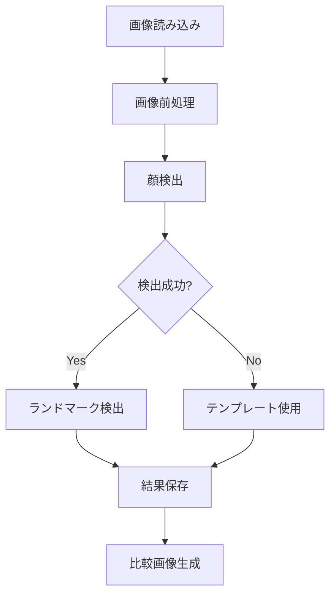

# NIR画像顔ランドマーク検出ツール

このツールは、NIR（近赤外線）画像から顔のランドマーク（特徴点）を自動検出するPythonアプリケーションです。dlibライブラリを使用して68個の顔ランドマークを検出し、画像の前処理から結果の可視化まで一貫した処理を行います。

## 主な機能

- **自動顔検出**: dlibを使用した高精度な顔検出
- **ランドマーク検出**: 68個の顔特徴点の自動検出
- **画像前処理**: 正規化、ガンマ補正、CLAHE、フィルタリング
- **バッチ処理**: 複数画像の並列処理
- **GUI操作**: 直感的なフォルダ選択とフィルタリング
- **結果可視化**: 比較画像とバウンディングボックスの表示
- **進捗表示**: tqdmによるリアルタイム進捗表示

## プロジェクト構造

```
landmark_NIR_ver4/
├── main.py                      # メイン実行スクリプト（エントリーポイント）
├── config.py                    # 設定クラス（パラメータ管理）
├── data_types.py                # データ型定義（dataclass）
├── logger.py                    # ログ管理（エラー記録）
├── image_processor.py          # 画像前処理（正規化、フィルタリング）
├── landmark_detector.py        # ランドマーク検出（dlib連携）
├── image_utils.py              # 画像処理ユーティリティ（保存、可視化）
├── processor.py                # 画像処理実行（個別画像処理）
├── directory_processor.py      # ディレクトリ処理（バッチ処理）
├── gui.py                      # GUIツール（フォルダ選択）
├── requirements.txt            # 依存パッケージ一覧
└── shape_predictor_68_face_landmarks.dat  # dlib学習済みモデル
```

## セットアップ

### 1. 仮想環境の作成と有効化

```bash
# 仮想環境の作成
conda create -n nir_landmark python=3.8

# 仮想環境の有効化
conda activate nir_landmark

# 必要なパッケージのインストール
conda install -c conda-forge dlib
pip install -r requirements.txt
```

### 2. 必要なファイルの確認

以下のファイルが存在することを確認してください：
- `shape_predictor_68_face_landmarks.dat` - dlibの学習済みモデルファイル
- 処理対象のNIR画像（.npy形式）

## 使用方法

### 方法1: GUIツールを使用する場合（推奨）

```bash
python gui.py
```

#### GUI操作手順

1. **フォルダの追加**
   - 「フォルダを追加」: 個別にフォルダを選択して追加
   - 「フォルダを一括追加」: 親フォルダを選択し、その中の.npyファイルを含むフォルダを一括追加

2. **フォルダの管理**
   - 「選択したフォルダを削除」: リストから不要なフォルダを削除
   - フォルダ名フィルター: 検索文字列を入力（カンマ区切りで複数指定可能）

3. **検出モードの選択**
   - **normal**: 高速処理（アップサンプリング0回）
   - **high**: 高精度処理（アップサンプリング0, 1, 2回）

4. **処理開始**
   - 「リストを保存して処理開始」ボタンを押すと自動的に処理が開始されます

### 方法2: コマンドラインから直接実行する場合

```bash
# 複数のフォルダを直接指定
python main.py --dirs folder1 folder2 folder3 --mode normal

# フォルダリストファイルを使用
python main.py --list folder_list.txt --mode high

# デフォルトモード（normal）で実行
python main.py --dirs folder1
```

## コマンドライン引数

| 引数 | 説明 | 例 |
|------|------|-----|
| `--dirs` | 処理するNIR画像（.npy形式）が含まれるディレクトリのパス（複数指定可能） | `--dirs folder1 folder2` |
| `--list` | 処理するディレクトリのパスが記載されたテキストファイル | `--list folder_list.txt` |
| `--mode` | 検出モード | `--mode normal` または `--mode high` |
| `--create-list` | フォルダリスト作成ツール（GUI）を起動 | `--create-list` |

### 検出モードの詳細

| モード | アップサンプリング回数 | 処理速度 | 検出精度 | 用途 |
|--------|----------------------|----------|----------|------|
| `normal` | 0回 | 高速 | 標準 | 一般的な処理 |
| `high` | 0, 1, 2回 | 低速 | 高精度 | 小さな顔や低解像度画像 |

## 出力結果

処理結果は以下のディレクトリ構造で保存されます：

```
processed_data/
├── detection_results.txt                    # 全体の検出結果サマリー
└── [入力ディレクトリ名]/
    ├── orignorm/                           # 正規化された元画像
    │   ├── image1_orignorm.npy
    │   └── image2_orignorm_ng.npy          # 検出失敗時は_ng付き
    ├── processed/                          # 前処理済み画像
    │   ├── image1_processed.npy
    │   └── image2_processed_ng.npy
    ├── landmarks/                          # 検出されたランドマーク
    │   ├── image1_landmarks.npy
    │   └── image2_landmarks_ng.npy
    ├── comparisons/                        # 比較画像（PNG形式）
    │   ├── image1_comparison.png
    │   └── image2_comparison_ng.png
    └── not_detected.txt                    # 検出失敗した画像のリスト
```

### 比較画像の内容

各比較画像には以下の3つのサブプロットが含まれます：
1. **オリジナル画像**: 元の画像（正規化済み）+ バウンディングボックス
2. **処理済み画像**: 前処理を適用した画像 + バウンディングボックス
3. **ランドマーク付き画像**: 検出されたランドマークとバウンディングボックスを表示

**バウンディングボックス**: 顔検出領域を青色の矩形で表示。サイズは`config.py`の`BOUNDING_BOX_SCALE_X/Y`で調整可能。

## 処理フロー



## モジュール詳細説明

### コアモジュール

| モジュール | 役割 | 主要機能 |
|------------|------|----------|
| **`config.py`** | 設定管理 | モデルパス、画像処理パラメータ、テンプレートランドマークの管理 |
| **`data_types.py`** | データ型定義 | 処理結果、検出情報などのデータクラス定義 |
| **`logger.py`** | ログ管理 | エラーログの記録と管理 |

### 処理モジュール

| モジュール | 役割 | 主要機能 |
|------------|------|----------|
| **`image_processor.py`** | 画像前処理 | 正規化、ガンマ補正、CLAHE、バイラテラルフィルタリング |
| **`landmark_detector.py`** | ランドマーク検出 | dlibを使用した顔検出と68点ランドマーク検出 |
| **`image_utils.py`** | 画像ユーティリティ | ディレクトリ設定、ファイル保存、比較画像の可視化 |
| **`processor.py`** | 個別画像処理 | 画像読み込み→前処理→検出→保存の一連の処理 |
| **`directory_processor.py`** | バッチ処理 | 複数画像の並列処理と進捗表示 |

### 実行モジュール

| モジュール | 役割 | 主要機能 |
|------------|------|----------|
| **`main.py`** | メインスクリプト | コマンドライン引数解析、処理実行の制御 |
| **`gui.py`** | GUIツール | フォルダ選択、フィルタリング、モード選択 |

## 技術仕様

### 使用ライブラリ

- **dlib**: 顔検出とランドマーク検出
- **OpenCV**: 画像処理（正規化、フィルタリング）
- **NumPy**: 数値計算と配列操作
- **matplotlib**: 画像可視化
- **tqdm**: 進捗表示
- **tkinter**: GUI作成

### 画像処理パイプライン

1. **正規化**: 画像の輝度値を0-255に正規化
2. **ガンマ補正**: コントラストの調整
3. **CLAHE**: 適応的ヒストグラム均等化
4. **バイラテラルフィルタ**: ノイズ除去とエッジ保持
5. **顔検出**: dlibのHOG特徴量ベース検出器
6. **ランドマーク検出**: 68点の顔特徴点検出

### バウンディングボックス調整

比較画像のバウンディングボックス（矩形）のサイズを調整できます：

#### 設定方法（config.py）

```python
# バウンディングボックス表示設定
BOUNDING_BOX_SCALE_X = 0.8  # 横幅倍率 (0.8=80%, 1.2=120%など)
BOUNDING_BOX_SCALE_Y = 1.0  # 縦幅倍率 (0.8=80%, 1.2=120%など)
```

#### 設定例

| 用途 | BOUNDING_BOX_SCALE_X | BOUNDING_BOX_SCALE_Y | 効果 |
|------|---------------------|---------------------|------|
| 横幅のみ縮小 | 0.8 | 1.0 | 横長の矩形を細く |
| 縦幅のみ拡大 | 1.0 | 1.2 | 縦長の矩形を高く |
| 全体拡大 | 1.2 | 1.2 | 矩形全体を大きく |
| 横長に調整 | 1.3 | 0.9 | 横長の矩形に変更 |

## 注意事項とトラブルシューティング

### システム要件

- **Python**: 3.8以上
- **メモリ**: 4GB以上推奨
- **ストレージ**: 処理画像サイズの3-4倍の空き容量

### よくある問題と解決方法

| 問題 | 原因 | 解決方法 |
|------|------|----------|
| 顔が検出されない | 画像の品質、解像度 | `--mode high`を使用 |
| メモリエラー | 画像サイズが大きすぎる | 画像をリサイズしてから処理 |
| dlibのインポートエラー | ライブラリのインストール不備 | `conda install -c conda-forge dlib`を実行 |
| バウンディングボックスが大きすぎる | 顔検出の精度 | `BOUNDING_BOX_SCALE_X/Y`を0.8などに縮小 |
| バウンディングボックスが小さすぎる | 顔検出の精度 | `BOUNDING_BOX_SCALE_X/Y`を1.2などに拡大 |
| 矩形が横長すぎる | 顔検出の形状 | `BOUNDING_BOX_SCALE_X`を縮小、`BOUNDING_BOX_SCALE_Y`を拡大 |

### パフォーマンス最適化

- **並列処理**: CPUコア数に応じて自動調整
- **メモリ効率**: 画像を逐次処理してメモリ使用量を抑制
- **進捗表示**: リアルタイムで処理状況を確認可能

## ライセンス

このプロジェクトは研究・教育目的で作成されています。商用利用の際は適切なライセンス確認を行ってください。
